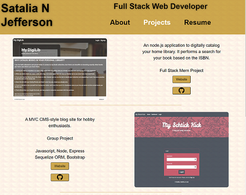
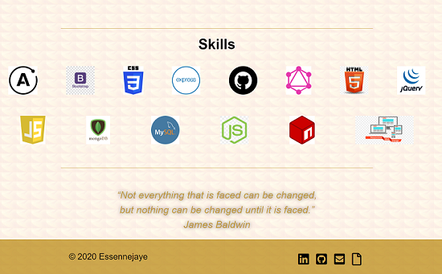

# SataliaJefferson

## My Portfolio Page Created with React

### This page presents the repository and published sites for the web development projects of Satalia Jefferson

https://essennejaye.github.io/webdev-showcase/

## Code snippet

```
import React from 'react'
import { capitalizeFirstLetter } from '../../utils/helpers';

const Nav = (props) => {
  const {
    pages = [],
    setCurrentPage,
    currentPage
  } = props;
  return (
    <nav className='nav-bar'>
      <ul>
        {pages.map((page) => (
          <li className={`mx-5 ${currentPage.name === page.name
            && 'navActive'
            }`}
            key={page.name}>
            <span
              onClick={() => {
                setCurrentPage(page);
              }}
            >
              {capitalizeFirstLetter(page.name)}
            </span>
          </li>
        ))}
      </ul>
    </nav>
  )
}
export default Nav;
```
## Screenshot



